# Class 01 Reading

## HTML Book 
### Introduction :book: : 
- in introduction we will learn how to make web page in html and css and describe the content of the book.
- this book divide to three section:
  - HTML
  - CSS
  - Practical

**In introduction how poaple can access**
- Poeple can access web by three way 
    1. Browsers : People access websites using
        software called a web browser.
        Popular examples include
        Firefox, Internet Explorer, Safari,
        Chrome, and Opera.

    2. Web Servers : When you ask your browser for
        a web page, the request is sent
        across the Internet to a special
        computer known as a web
        server which hosts the website.
    
    3. Screen readers : Screen readers are programs
        that read out the contents of a
        computer screen to a user. They
        are commonly used by people
        with visual impairments.

## Let's go deep and see how the web work :earth_africa: :
- When you visit a website, the web server
hosting that site could be anywhere in the
world. In order for you to find the location of
the web server, your browser will first connect
to a Domain Name System (DNS) server.

# Chapter 1 :book: :
## Structure : 
- all web site build by spacific structure.
- structure is very important in helping
    readers to understand the messages you are trying to convey
    and to navigate around the document.

- The use of headings and
    subheadings in any document
    often reflects a hierarchy of
    information. For example, a
    document might start with
    a large heading, followed by
    an introduction or the most
    important information.

# Chapter 8 :book: :
## Extra Markup : 
- We will cover in this chpter the follwing topic :
    1. The different versions of HTML and how to      indicate which
        version you are using
    2. How to add comments to your code
    3. Global attributes, which are attributes that can be used on
    any element, including the class and id attributes 
    4. Elements that are used to group together parts of the page
    where no other element is suitable
    5. How to embed a page within a page using iframes
    6. How to add information about the web page using the
        meta element
    7. Adding characters such as angled brackets and copyright
    symbols

## The Evolution of HTML 

#### Since the web was first created, there have been several different versions of HTML.

- HTML 4 Released 1997
- XHTML 1.0 Released 2000
- HTML5 Released 2000

## Some HTML tachnique

- Comments in HTML
    - If you want to add a comment
    to your code that will not be
    visible in the user's browser, you
    can add the text between these
    characters:
    `<!-- comment goes here -->`

- ID Attribute :
    - Every HTML element can carry
    the id attribute. It is used to
    uniquely identify that element
    from other elements on the
    page. Its value should start with
    a letter or an underscore (not a
    number or any other character).
    It is important that no two
    elements on the same page
    have the same value for their id
    attributes (otherwise the value is
    no longer unique).

    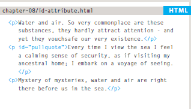

- Class Attribute: 
  - Every HTML element can
    also carry a class attribute.
    Sometimes, rather than uniquely
    identifying one element within
    a document, you will want a
    way to identify several elements
    as being different from the
    other elements on the page.
    For example, you might have
    some paragraphs of text that
    contain information that is more
    important than others and want
    to distinguish these elements, or
    you might want to differentiate
    between links that point to other
    pages on your own site and links
    that point to external sites.

    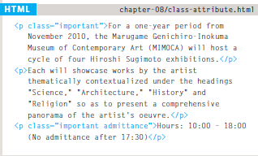

- Grouping Text & Elements In a Block
   - The `
` element allows you to
        group a set of elements together
        in one block-level box.

        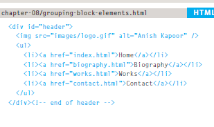

    
- IFrames
    - `<iframe> `
        An iframe is like a little window
        that has been cut into your
        page — and in that window you
        can see another page. The term
        iframe is an abbreviation of inline
        frame.

        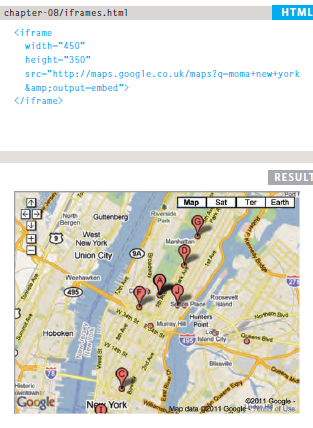

- Information About Your Pages
    - `<meta>`
    The `<meta>` element lives
    inside the `<head>` element and
    contains information about that
    web page.
    - **description**
        This contains a description
        of the page. This description
        is commonly used by search
        engines to understand what the
        page is about and should be a
        maximum of 155 characters.
        Sometimes it is also displayed in
        search engine results.
    - **keywords**
        This contains a list of commaseparated
        words that a user
        might search on to find the page.
        In practice, this no longer has
        any noticeable effect on how
        search engines index your site.
    - **robots**
        This indicates whether search
        engines should add this page
        to their search results or not. A
        value of noindex can be used if
        this page should not be added. A
        value of nofollow can be used
        if search engines should add this
        page in their results but not any
        pages that it links to.

         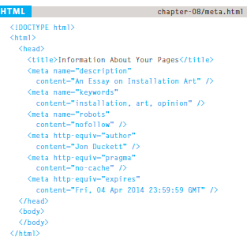

# Chapter 17 :book: :
### HTML5 Layout :
- HTML5 is introducing a new set of
elements that help define the structure of
a page.

### Traditional HTML Layouts

- For a long time, web page authors used              `
`elements to group
    together related elements on the page (such as the elements that form a
    header, an article, footer or sidebar). Authors used class or id attributes
    to indicate the role of the `
`element in the structure of the page.

    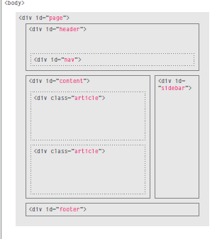

### New Html 5 Layout Elements
#### Headers & Footers
- `<header> <footer>`
 - The `<header>` and `<footer>`
    elements can be used for:
    1. The main header or footer
    that appears at the top or
    bottom of every page on the
    site.
    2. A header or footer for an
    individual `<article>` or
    `<section>` within the page.

    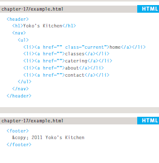
### Navigation
-  `<nav>`
    - The `<nav>` element is used to
        contain the major navigational
        blocks on the site such as the
        primary site navigation.
    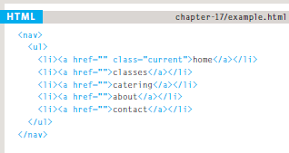

### Articles
- `<article>`
 - The `<article>` element acts as
    a container for any section of a
    page that could stand alone and
    potentially be syndicated.

    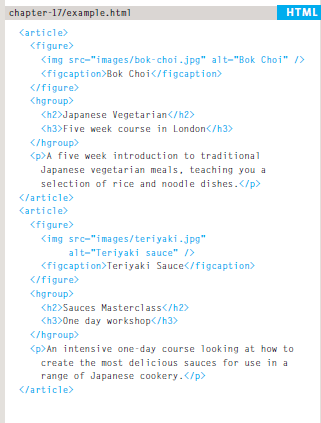

# Chapter 18 :book: :
### Process & Design

1. It describe how to build the website and mentioned the criteria that we should follow to design the web site

2. It give us some questions should we ask to understand the audience's needs?

2. 0. there is two type of audience 
   - individuals
   - Companies
   - and this some of question:
   
      1. Who is the site For ?
      Every website should be designed for the target audience and not just for yourself or the site owner.You should know if your vistitors are individuals or companies and if they are individuals you should know thier age and the area they live in .. etc.

      2. Why PeoPle visit your Website ?
      Here you should search for your vistors Key motivations and specific goals.

      3. What your visitors are trying to achieve ?
      You should create a list of reasons why people would be coming to your site. 

      4. What information your visitors need ?
      Now you need to work out what information they need in order to achieve their goals quickly and effectively.

      5. How often people will visit your site ?
      Working out how often people are likely to revisit your site gives you an indication for how often you should update the site.

      
3. it determain why poeple will visit the website we will design and 
the reason for that.

4. It Describe to us what is the information type that we must provide for our visiters.

5. It explain how will by site map and how many section will be in our website

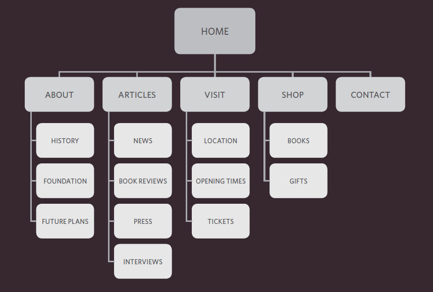

6. there is also Wireframe it is simply sketch to explain what is the information in each page

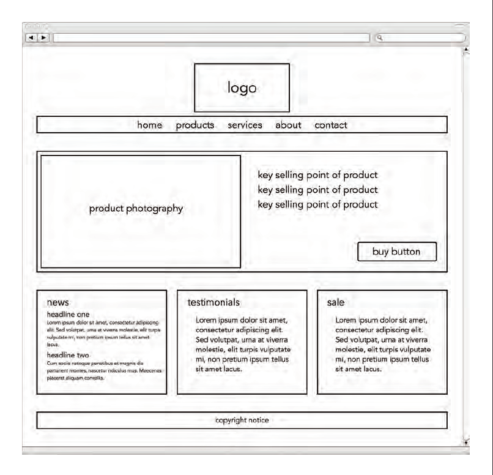

7. In this Chapter also show us how to organizing content in each page to make users understand what is important and what is not.

8. finally it give us some tips on Grouping and similarity and how we can design navigation bar 

