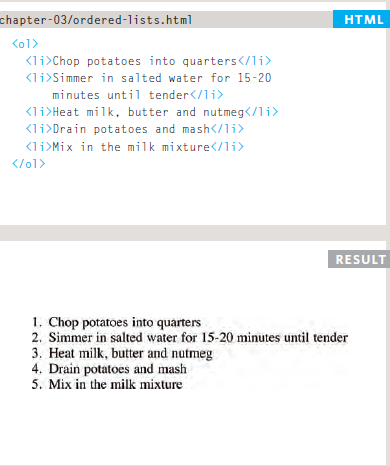
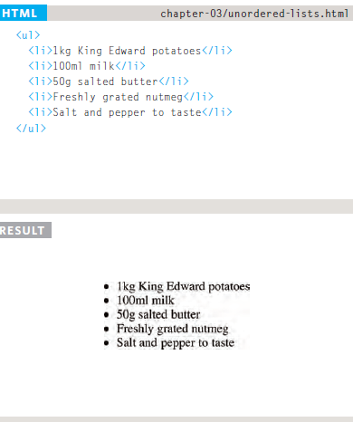
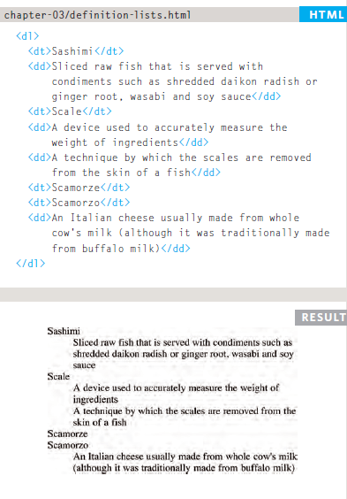
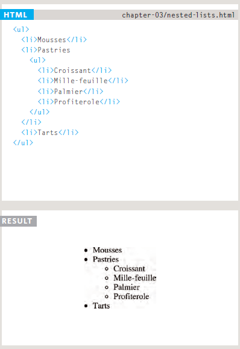
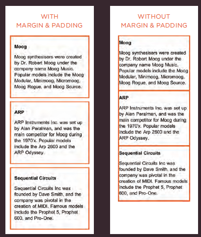
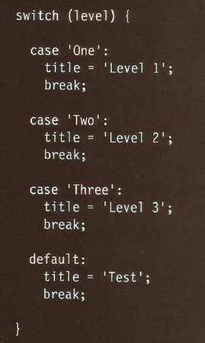

# Class 03 Reading

# HTML
## Chapter 3 List
- there are three type of list that html provide:
 1. Ordered List
 2. Unordered List
 3. Definition List

#### Ordered List :
- are lists where each item in the list is
    numbered.
- to create ordered list we use the tage `<ol></ol>`
this tag to create it and to create the item we use the tag `<li></li>`
- in this way we will create order list.
### example 

#### Unordered List :
- are lists that begin with a bullet point
- to create ordered list we use the tage `<ul></ul>`
this tag to create it and to create the item we use the tag `<li></li>`
- in this way we will create order list.
### example 

#### Definition List :
- are made up of a set of terms along with the
definitions for each of those terms.
- we can created Definition by use tag `<dl></dl>`.
- to ctrate tage that will contain the term that will by defined we will use `<dt></dt>`
- to create the tag that will contain the definition we will use the tag `<dd> </dd>`

### example 

## Nested List
- we can llist inside anther list and we can call it nested list
- **how we can write it?**
    - we can defined it by useing the `<li></li>` tag 
    we put the new list inside it and that how to create it.

### example 

# Summary
1. There are three t XX ypes of HTML lists: ordered,
unordered, and definition.
2. Ordered lists use numbers.
3. Unordered lists use bullets.
4. Definition lists are used to define terminology.
5. Lists can be nested inside one another.

# CSS
## Chapter 13 Boxes
- in this chapter we will see how CSS treats each HTML
element as if it lives in its own box.

### Properties of Boxes
#### Box Dimensions
- each box can have width and height to spicify it's dimentions 
- The most popular ways to specify the size of a box are to use pixels, percentages, or ems.
- we can also use Limiting Width to the box by use min-width, max-width
- we can also use Limiting Height to the box by use min-height, max-height

#### Overflowing Content
- we can use overflow to set the width and height if we have text that bigger than the box that contain it by use `overflow`
- and it can take many property:
    1. hidden This property simply hides any extra content that does not fit in the box.
    2. scroll This property adds a scrollbar to the box so that users can scroll to see the missing content.

#### Border, Margin & Padding
- Every box has three available properties that
can be adjusted to control its appearance:
#### Border
Every box has a border (even if
it is not visible or is specified to
be 0 pixels wide). The border
separates the edge of one box
from another.

#### Margin
Margins sit outside the edge
of the border. You can set the
width of a margin to create a
gap between the borders of two
adjacent boxes.

#### Padding
Padding is the space between
the border of a box and any
content contained within it.
Adding padding can increase the
readability of its contents.

- The padding and margin properties are very helpful in adding space 
   between various items on the page.

# CSS Proberties
# Border
## 1. Border Width
 - The border-width property
is used to control the width
of a border. # border-width
- it can take many value: 
    1. thin
    2. medium
    3. thick
- we can use also specify different widths for the four border values in one property by :
    - border-width: 2px 1px 1px 2px;

- also it can take scpecific direction :
1. border-top-width
2. border-right-width
3. border-bottom-width
4. border-left-width

## 2. Border Style
- You can control the style of a
border using the border-style
property.
- it can take many value: 
1. solid : a single solid line
2. dotted : a series of square dots
(if your border is 2px wide, then
the dots are 2px squared with a
2px gap between each dot)
3. dashed : a series of short lines
4. double : two solid lines (the
value of the border-width
property creates the sum of the
two lines)
5. groove : appears to be carved
into the page
6. ridge : appears to stick out from
the page
7. inset : appears embedded into
the page
8. outset : looks like it is coming
out of the screen
9. hidden / none no border is
shown

## 3. Border Color
- You can specify the color of a
border using either RGB values,
hex codes or CSS color names

- it can take four specifiy direction: 
1. border-top-color
2. border-right-color
3. border-bottom-color
4. border-left-color

# Summary
- CSS treats each HTML e XX lement as if it has its own box.
- You can use CSS to control the dimensions of a box.
- You can also control the borders, margin and padding
for each box with CSS.
- It is possible to hide elements using the display and
visibility properties.
- Block-level boxes can be made into inline boxes, and
inline boxes made into block-level boxes.
- Legibility can be improved by controlling the width of
boxes containing text and the leading.
- CSS3 has introduced the ability to create image
borders and rounded borders.

# JavaScript 
## Chapter 2: Basic JavaScript Instructions

### USING QUOTES INSIDE A STRING
- Sometimes you will want to use
a double or single quote mark
within a string.
- it call escaping character This is done by
using a backwards slash (or
"backslash") before any type of
quote mark that appears within
a string

### USING A VARIABLE TO STORE A BOOLEAN
- A Boolean variable can only have
a va lue of true or fa 1 se, but this
data type is very helpful.

### SHORTHAND FOR CREATING VARIABLES
- there is three way to Creating Variable:
    1. Variables are declared and
    values assigned in the same
    statement.
    2. Three variables are declared
    on the same line, then values
    assigned to each.
    3. Two variables are declared
    and assigned values on the same
    line. Then one is declared and
    assigned a value on the next line

### CHANGING THE VALUE OF A VARIABLE
- we can change the value of variable after we defined it this method is called overwritting

## Chapter 4: Decisions and Loops

## SWITCH STATEMENTS 
- A switch statement starts with a
variable called the switch value.
Each case indicates a possible
value for this variable and the
code that should run if the
variable matches that value.

- switch can take value we call it a selector and this selector can take three value :
    1. String
    2. Integer(number)
    3. Boolean
## Examole for switch

### Different between If and Switch

